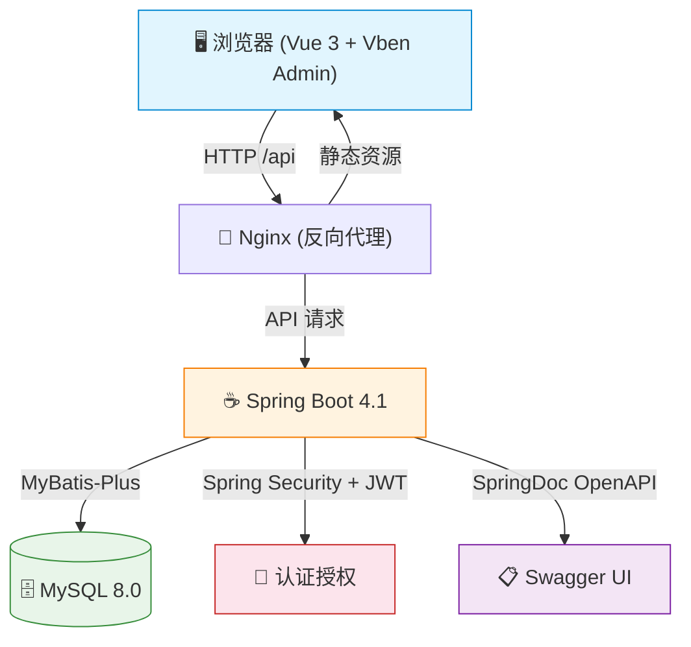
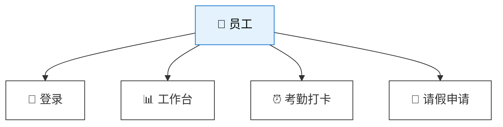
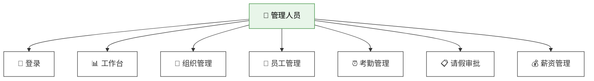
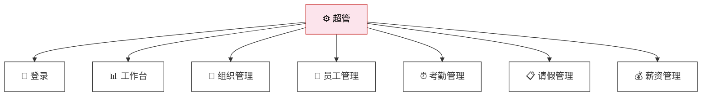
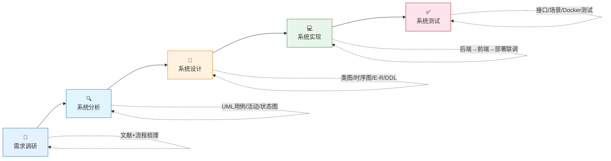
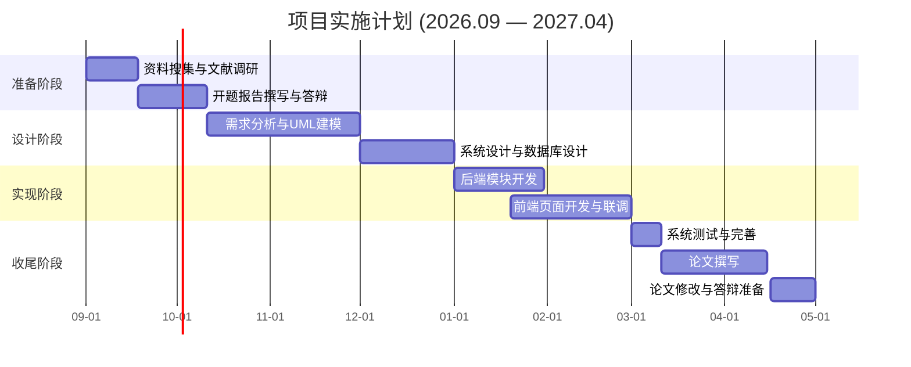

# 智汇人事管理系统
## 可行性研究报告答辩

  
所在专业：计算机科学与技术 | 班级：B2301 | 学号：0914423088 | 姓名：韩宇坤

  
1. 研究背景 与目的

  
2. 文献综述

  
3. 可行性分析

  
4. 系统架构 与技术栈

  
5. 核心功能 模块

  
6. 创新点

  
7. 实施方案 与技术路线

  
8. 预期成果

  
9. 推广及 应用价值

  
10. 总结与致谢

---
layout: two-cols
class: text-left
---

# 研究背景与目的

<v-click>

## 📋 研究背景

- **企业痛点**：中小企业人事管理仍依赖 Excel + 纸质审批，数据分散、统计滞后、权限难控
- **技术成熟**：Spring Boot + Vue 前后端分离、JWT 认证等技术日趋成熟
- **市场缺口**：商业 HR SaaS 成本高、功能冗余，中小企业难以承受
- **实践价值**：自主可控、功能适中、可部署交付的人事管理系统具有明确必要性与实践价值

</v-click>

::right::

<v-click>

## 🎯 研究目的

**一个平台 + 四个目标：**

1. **业务整合** — 部门、员工、考勤、请假、薪资统一管理
2. **流程规范** — 打卡、审批状态留痕，替代口头/纸质流转
3. **安全可控** — RBAC 权限 + JWT 认证 + 数据范围隔离
4. **技术实践** — 全栈开发（需求→设计→实现→部署）

</v-click>

---
layout: default
class: text-left
---

# 文献综述

<v-click>

## 🔍 研究范围与策略

- **数据库来源**：CNKI、万方、Web of Science、IEEE Xplore
- **时间范围**：2020—2025 年
- **关键词**：HRM 系统、考勤管理、请假审批、Spring Boot、Vue、RBAC

</v-click>

<v-click>

## 📊 文献分类

| 阶段 | 关键技术 | 特点 |
|------|----------|------|
| 传统 | JSP/Servlet+SSH | 功能单一，档案为主 |
| 框架化 | Spring Boot+MyBatis | 模块化，REST 普及 |
| 智能化 | 微服务+前后端分离 | 移动打卡，数据分析 |

</v-click>

<v-click>

## 💡 核心发现

- 人事系统应**模块化、服务化**演进，子系统相对独立又数据互通
- **考勤与请假联动**是核心场景，需保证时间冲突校验与状态一致
- **前后端分离**已成为主流架构
- 中小企业场景下，**轻量级单体架构**性价比更高

</v-click>

<v-click>

## ⚠️ 研究空白（本课题切入点）

1. 多数案例偏理论，缺少**完整可运行的后端实现**
2. 考勤与请假常独立开发，**业务联动考虑不足**
3. 面向中小企业的**精简开源参考较少**

</v-click>

---
layout: default
class: text-left
---

# 可行性分析

<v-click>

## <mdi-cog class="text-blue-600"/> 技术可行性 ✅ 高

- **Java 17 + Spring Boot 4.1** — 生态成熟，文档完善
- **MyBatis-Plus + MySQL 8.0** — 高效数据操作
- **Spring Security + JWT** — 无状态认证
- **Vue 3 + Vite + Vben Admin** — 现代前端框架
- **Docker Compose** — 一键部署
- 核心业务模块**全部已实现**，并扩展任务协作 / 通知 / AI / 导出 / 操作审计

</v-click>

<v-click>

## <mdi-cash class="text-green-600"/> 经济可行性 ✅ 高

- **硬件**：现有 PC 即可，无需采购服务器
- **软件**：JDK、MySQL、IDEA 社区版、Node.js 等**全部免费/开源**
- **部署**：MySQL 社区版免费，Docker 本地运行
- **人力**：学生独立开发，无团队支出

  → 与商业 SaaS 按年按人订阅相比，几乎零直接经济门槛

</v-click>

<v-click>

## <mdi-account-details class="text-orange-600"/> 操作可行性 ✅ 高

- **4 类角色**：超管 / HR / 部门经理 / 员工，分工清晰
- **界面友好**：Ant Design Vue 组件，表格/表单/日历即用
- **接口规范**：RESTful `/api` 统一前缀 + 规范响应格式
- **学习成本低**：员工端仅 3 步操作（登录→打卡→请假）
- **部署简单**：JAR 一键启动 or Docker 一键拉起

</v-click>

  
结论：技术可行 · 经济可行 · 操作可行 → 项目可启动

---
layout: default
class: text-left
---

# 系统架构与技术栈

<v-click>

## 技术栈一览

| 层次 | 技术选型 |
|------|----------|
| 后端框架 | Spring Boot 4.1.0 |
| 安全框架 | Spring Security + JWT |
| 持久层 | MyBatis-Plus 3.5.16 |
| 数据库 | MySQL 8.0 |
| 前端框架 | Vue 3 + Vite + Pinia |
| UI 组件 | Ant Design Vue (Vben Admin) |
| 接口文档 | SpringDoc OpenAPI 3.0 |
| 构建工具 | Maven + pnpm |
| 反向代理 | Nginx |
| 容器化 | Docker + Docker Compose |

</v-click>

---
layout: default
class: text-left
---

# 核心功能模块

**员工视角** — 个人自助操作

**HR/经理视角** — 全部功能可操作

**超级管理员** — 全部功能+代打卡

  
<b>公共支撑</b> 统一响应格式/异常处理/逻辑删除

  
<b>认证授权</b> JWT 无状态 + RBAC 四级角色

  
<b>业务模块</b> 组织/员工/考勤/请假/任务/薪资/通知/AI

  
<b>部署方案</b> Docker Compose + Nginx 一键启动

---
layout: default
class: text-left
---

# 创新点

<v-click>

  
🔗

  

    <b>角色化数据权限与 RBAC 融合</b>
    
同一接口下，员工/经理/HR 获得不同数据视图，兼顾安全与简洁性

  

</v-click>

<v-click>

  
🔄

  

    <b>员工入职 — 账号一体化建档</b>
    
同一事务中自动创建登录账号 + 加密密码 + 绑定角色

  

</v-click>

<v-click>

  
📌

  

    <b>多场景打卡 + 健壮性设计</b>
    
自助打卡 / 超管代打 / HR 补录，兼容"先补录再更新"防索引冲突

  

</v-click>

<v-click>

  
🛡

  

    <b>请假业务规则完备化</b>
    
时间冲突检测 + 天数校验 + 审批/驳回/撤销状态机 + 角色过滤待办

  

</v-click>

<v-click>

  
🎯

  

    <b>角色化工作台</b>
    
按角色动态展示考勤月历、统计指标、快捷入口，提升差异化使用体验

  

</v-click>

<v-click>

  
📦

  

    <b>轻量级全栈可部署架构</b>
    
单体 + 前端 + Nginx + Docker Compose，降低学习、演示与二次开发门槛

  

</v-click>

---
layout: default
class: text-left
---

# 实施方案与技术路线

<v-click>

## 🔬 研究方法（五阶段）

</v-click>

<v-click>

## 🛠 开发工具链

| 类别 | 工具 | 用途 |
|------|------|------|
| IDE | IntelliJ IDEA / VS Code | 后端 / 前端开发 |
| 构建 | Maven / pnpm | 依赖管理 |
| 数据库 | MySQL 8.0 + Navicat | 存储与管理 |
| 调试 | Postman / Swagger | 接口测试 |
| 部署 | Docker + Nginx | 容器化一键启动 |

</v-click>

<v-click>

## 📅 实施进度甘特图

</v-click>

---
layout: default
class: text-left
---

# 预期成果与推广价值

<v-click>

## 🎁 预期成果

**软件成果：**
- ✅ Spring Boot 后端 JAR + 完整 REST API
- ✅ Vue Vben Admin 前端 Web 应用
- ✅ MySQL 初始化脚本（schema + seed data）
- ✅ Docker Compose 一键部署方案

**文档成果：**
- ✅ 可行性研究报告、需求分析说明书
- ✅ 数据库设计文档、系统测试报告
- ✅ 项目 README（快速开始 + 部署指南）

**能力成果：**
- ✅ 全栈开发能力（Spring Boot → Vue → Docker）
- ✅ 独立设计实现中小型管理信息系统

</v-click>

<v-click>

## 📈 推广及应用价值

**经济效益**
- 降低管理成本，减少人工 Excel 维护
- 免去商业 SaaS 高昂的按年订阅费用
- 提高数据准确性，减少考勤纠纷

**社会效益**
- 促进中小企业人事管理规范化
- 保障敏感人事数据安全可控
- 服务教学实践，培养全栈人才

**推广策略**
- 校内开源共享 → 小范围试点 → 已落地：Excel 导出 / 操作审计 / 任务看板附件 / AI 助手；后续可扩展移动打卡

</v-click>

---
layout: center
class: text-center
---

# 感谢聆听

## 恳请各位老师批评指正

  
☕

  <b>技术栈</b> 
  Spring Boot 4.1 + Vue 3 
  MyBatis-Plus + MySQL 8.0 
  Docker + Nginx

  
📦

  <b>已实现模块</b> 
  组织/员工/考勤/请假/任务/薪资 
  通知·AI·导出·操作日志 
  Docker + Nginx 可部署

  
🎓

  <b>项目信息</b> 
  韩宇坤 · 0914423088 
  计算机科学与技术 B2301 
  指导教师：

  
智汇人事管理系统 — 基于 Spring Boot + Vue 前后端分离架构的中小企业人力资源管理平台

