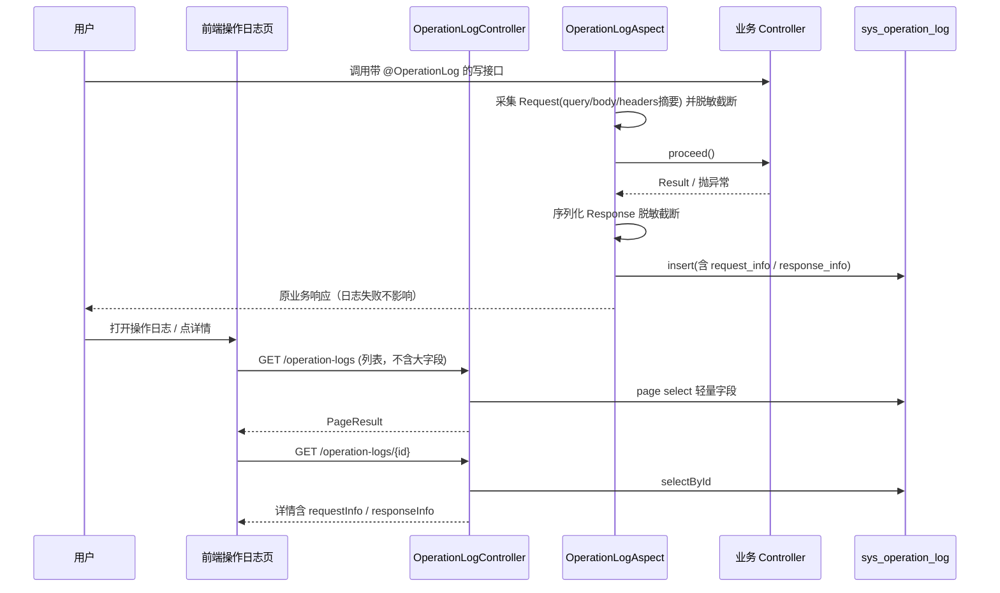

# 技术设计文档: 操作日志升级（Request / Response）

## 0. 设计概要 (Design Summary)

* **功能描述**：增强 `@OperationLog` 落库内容，支持审计人员查看结构化 Request 与 Response；前端增加详情抽屉。
* **影响范围**：
  * 后端：`OperationLogAspect`、`sys_operation_log`、OperationLog 实体/VO/Service/Controller
  * 前端：`views/hr/operation-log`、对应 API 类型
* **技术难点**：入参/出参 JSON 序列化与脱敏；大报文截断；列表与详情字段拆分避免分页膨胀
* **依赖关系**：复用现有 `@OperationLog` 注解与 `feat.audit.view` / 角色鉴权；复用/扩展 `LogSanitizer`

> 开放问题默认取值（可改）：只记 Content-Type；单字段截断 **8192** 字符；详情用 **Drawer**。

## 1. 架构概览 (Architecture Overview)



**数据流**

1. 仅当方法标注 `@OperationLog` 时落库（与现网一致）
2. Request：从 `HttpServletRequest` + 方法参数组装 JSON 字符串
3. Response：成功则序列化返回值；失败则写错误结构
4. 前端列表不拉大字段；详情按 id 拉取全文

## 2. API 设计 (API Design)

### 2.1 接口列表

| 接口名称 | 方法 | 路径 | 描述 | 对应验收标准 |
| :--- | :--- | :--- | :--- | :--- |
| 分页查询 | GET | `/operation-logs` | 列表（不含完整 request/response） | AC-005/006 |
| 日志详情 | GET | `/operation-logs/{id}` | 含 requestInfo / responseInfo | AC-001/002/007 |

### 2.2 接口详情

#### 接口 1: 分页查询（调整返回字段）

* **路径**: `GET /operation-logs`
* **鉴权**: `hasAnyRole('SUPER_ADMIN','HR_ADMIN')`
* **Query**: 保持现有 `module/status/userId/startTime/endTime/pageNum/pageSize`
* **Response data.records 字段**:
  * 保留：`id,userId,username,module,operation,method,ip,status,errorMsg,duration,createdAt`
  * **不再返回**（或恒为 null）：`params` 全文、`requestInfo`、`responseInfo`（降低列表体积）
  * 可选增加：`hasDetail=true`（恒 true 即可）

#### 接口 2: 日志详情（新增）

* **路径**: `GET /operation-logs/{id}`
* **鉴权**: 同上
* **Response (成功)**:
```json
{
  "code": 200,
  "message": "操作成功",
  "data": {
    "id": 1001,
    "userId": 1,
    "username": "admin",
    "module": "员工管理",
    "operation": "修改员工",
    "method": "PUT /employees/12",
    "ip": "10.0.0.1",
    "status": 1,
    "errorMsg": null,
    "duration": 45,
    "createdAt": "2026-09-04T17:20:00",
    "requestInfo": "{\n  \"contentType\": \"application/json\",\n  \"query\": {},\n  \"body\": { \"name\": \"张三\", \"phone\": \"13800000000\" }\n}",
    "responseInfo": "{\n  \"code\": 200,\n  \"message\": \"操作成功\",\n  \"data\": null\n}"
  }
}
```
* **Response (失败)**:
  * 记录不存在 → `code=404`，message「日志不存在」
  * 无权限 → 403

* **历史兼容**: `requestInfo`/`responseInfo` 为空时前端展示提示文案（AC-007）；可将旧 `params` 一并返回到详情的 `requestInfo` 回退字段：
  * 规则：`requestInfo` 优先；为空则用 `params` 填充展示

## 3. 数据库设计 (Database Schema)

### 3.1 修改表 `sys_operation_log`

* **变更说明**：新增 Request / Response 大文本字段；保留原 `params` 兼容历史与回退展示

* **Flyway**: `V23__operation_log_req_resp.sql`

```sql
ALTER TABLE sys_operation_log
    ADD COLUMN request_info  MEDIUMTEXT NULL COMMENT '请求信息(JSON，已脱敏/截断)' AFTER params,
    ADD COLUMN response_info MEDIUMTEXT NULL COMMENT '响应信息(JSON，已脱敏/截断)' AFTER request_info;
```

* **字段定义**:

| 字段名 | 类型 | 约束 | 说明 |
| :--- | :--- | :--- | :--- |
| request_info | MEDIUMTEXT | NULL | 结构化请求 JSON 字符串 |
| response_info | MEDIUMTEXT | NULL | 结构化响应 JSON 字符串 |

* **数据迁移**: 无需回填；旧数据两字段为 NULL

### 3.2 实体 / VO

* `OperationLog` 增加 `requestInfo`、`responseInfo`
* `OperationLogVO` 增加同上；列表 VO 可拆 `OperationLogListVO`（无大字段）与详情 VO，或列表查询 SQL 不 select 这两列

## 4. 核心逻辑与算法 (Core Logic)

### 4.1 切面采集（`OperationLogAspect`）

* **触发条件**: `@Around("@annotation(opLog)")`（不变）
* **处理步骤**:
  1. 读取 `HttpServletRequest`：method、URI、queryString、contentType、ip
  2. 组装 `requestInfo` JSON：
     * `contentType`
     * `query`: 解析 query string 为 map（无则 `{}`）
     * `body`: 方法参数经脱敏序列化（见 4.2）；`MultipartFile` → `{ fileName, size }`
     * 跳过 `HttpServletRequest` / `HttpServletResponse` / `BindingResult`
  3. `proceed()` 执行业务
  4. 成功：`responseInfo = truncate(toJson(result))`
  5. 失败：`responseInfo = {"error":"<SimpleName>","message":"..."}`，同时写 `error_msg`/`status=0`
  6. `params`：可继续写一份简短摘要（兼容旧逻辑），或改为与 body 相同截断串；**建议保留短摘要 ≤512 字符**，完整内容进 `request_info`
  7. insert；异常 catch 只打 warn，不影响业务

### 4.2 序列化与脱敏

* 使用项目已有 Jackson `ObjectMapper`（或新建 `OperationLogJson` 组件）
* 扩展 `LogSanitizer`（或新建 `OperationLogSanitizer`）：
  * Map/JSON 树递归：key 匹配（忽略大小写）`password|oldPassword|newPassword|confirmPassword|token|accessToken|refreshToken|authorization|mfaCode|secret|descriptor` → 值改为 `***`
  * `byte[]` / 超长 base64 字符串（如 length>500 且像 base64）→ `[omitted]`
  * 生产环境若曾对非登录参数只打类名：操作日志审计场景改为 **脱敏后的字段级 JSON**（否则看不清 request）；登录类 URI 仍可整段省略 body
* **截断**:
```
function truncate(s, max=8192):
  if s == null: return null
  if len(s) <= max: return s
  return s[0:max] + "...(truncated, total=" + len(s) + ")"
```

### 4.3 列表查询性能

* `OperationLogService.page`：`select` 明确列，**排除** `request_info`、`response_info`（及可选排除 `params`）
* `getById`：全字段 + 补 username

### 4.4 前端

* 列表增加操作列「详情」
* `Drawer` width=`680`：Descriptions 基本信息 + 两个 `pre`/代码块（Request / Response）+ 复制按钮
* API：
  * `getOperationLogs` 不变
  * 新增 `getOperationLogDetail(id)`

## 5. 异常处理 (Error Handling)

| 异常场景 | 对应验收标准 | 处理方案 | 用户提示 |
| :--- | :--- | :--- | :--- |
| 日志 insert 失败 | AC-004 | catch 后 warn，业务照常返回 | 无（用户无感） |
| JSON 序列化失败 | AC-001 | 降级为 `String.valueOf` / `[serialize error]` | 详情可见降级文本 |
| 详情 id 不存在 | AC-007 | 404 | 「日志不存在」 |
| 无权限 | AC-006 | 403 | 统一无权限提示 |
| 历史无 response | AC-007 | 前端空态文案 | 「无响应记录（升级前日志）」 |
| 文件上传 | AC-008 | 只记文件元数据 | — |

## 6. 安全与性能 (Security & Performance)

* **鉴权**: 详情接口与列表相同角色限制
* **脱敏**: 必须在落库前完成，禁止明文密码/token 入库
* **体积**: 单字段 8192 字符截断；MEDIUMTEXT 防极端溢出
* **性能**: 列表不查大字段；切面序列化控制在毫秒级，禁止深拷贝大文件流
* **安全**: Response 中若含 token（如登录，一般无 OperationLog）同样脱敏

## 7. 验收标准映射 (AC Mapping)

| 验收标准ID | 对应技术实现 |
| :--- | :--- |
| AC-001 | 切面写 `request_info`/`response_info` + 详情 API + Drawer |
| AC-002 | 失败分支写 response 错误 JSON + status/errorMsg |
| AC-003 | Sanitizer 递归脱敏 |
| AC-004 | truncate + insert try/catch |
| AC-005 | 列表 select 排除大字段 |
| AC-006 | `@PreAuthorize` 详情接口 |
| AC-007 | NULL 兼容 + 前端空态；params 回退 |
| AC-008 | MultipartFile 特殊格式化 |

## 8. 技术决策说明 (Technical Decisions)

* **决策1：独立详情接口，而非列表带全文**
  * 理由：操作日志列表常用，全文 JSON 会显著增大 payload
* **决策2：新增列而非覆盖 `params`**
  * 理由：兼容历史数据与现有报表/排查习惯；`params` 作短摘要回退
* **决策3：同步 insert，不引入 MQ**
  * 理由：体量小、截断后成本低；与现网切面一致，改动面小
* **决策4：结构化 JSON 字符串落库，而非多列拆分 query/body**
  * 理由：扩展灵活，前端一次渲染；查询侧暂无按 body 字段检索需求

## 9. 风险与注意事项 (Risks & Notes)

* **技术风险**: 部分返回类型（`ResponseEntity<Resource>`）不可完整序列化 → 统一占位
* **兼容性**: Flyway V23；本地/生产按现有升级流程执行
* **性能影响**: 写路径增加一次 JSON 序列化；需关注大 DTO（已截断）
* **回滚方案**: 回滚应用版本即可；列可保留（可空）不影响旧代码读写（旧代码忽略新列）

## 10. 实施清单（开发顺序）

1. Flyway V23 加列
2. Entity / VO / Mapper 查询列调整
3. Sanitizer + Aspect 采集 request/response
4. 新增 `GET /operation-logs/{id}`
5. 前端详情 Drawer + API
6. 自测：改员工（成功）、故意失败接口、上传文档、查历史日志